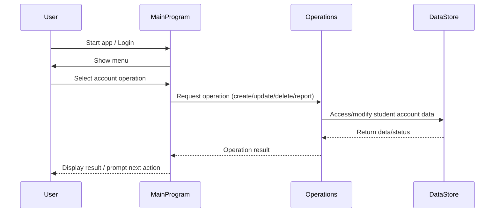

## Sequence Diagram: Student Account App Data Flow

# Project Documentation

This directory contains documentation for the project.

## COBOL Source Files Overview

The COBOL files are located in `src/cobol/` and serve the following purposes:

### data.cob
- **Purpose:** Defines data structures and record layouts used throughout the application.
- **Key Functions:**
	- Student account record definitions
	- Field specifications for student information (ID, name, balance, etc.)
- **Business Rules:**
	- Ensures all student account data is consistently formatted and validated before processing.

### main.cob
- **Purpose:** Entry point and main program logic for student account management.
- **Key Functions:**
	- Program initialization
	- Menu navigation and user interaction
	- Calls to operations for account actions
- **Business Rules:**
	- Only authenticated users can access account operations
	- Handles error checking and user prompts

### operations.cob
- **Purpose:** Contains business logic for student account operations.
- **Key Functions:**
	- Create, update, and delete student accounts
	- Process deposits and withdrawals
	- Generate account reports
- **Business Rules:**
	- Prevents overdrafts and negative balances
	- Enforces account creation and modification rules (e.g., unique student IDs)
	- Validates transaction amounts and account status before processing

## Additional Notes
- For setup and usage instructions, see the main [README.md](../README.md).
- Add further documentation here as needed for new features or business rules.